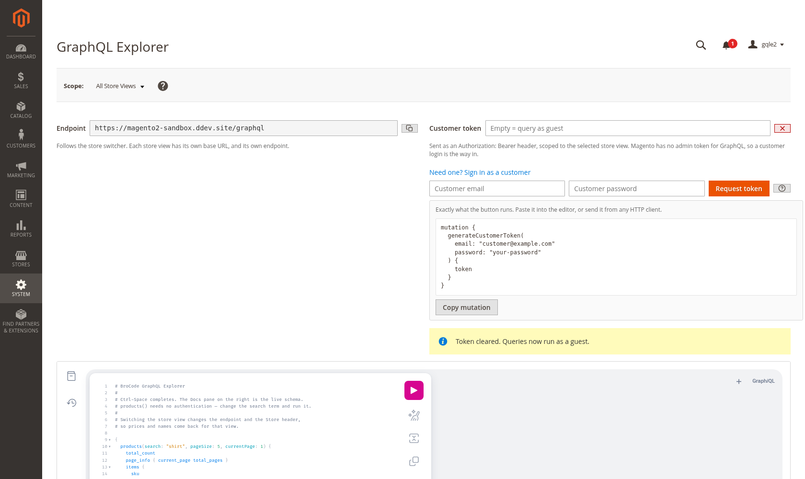
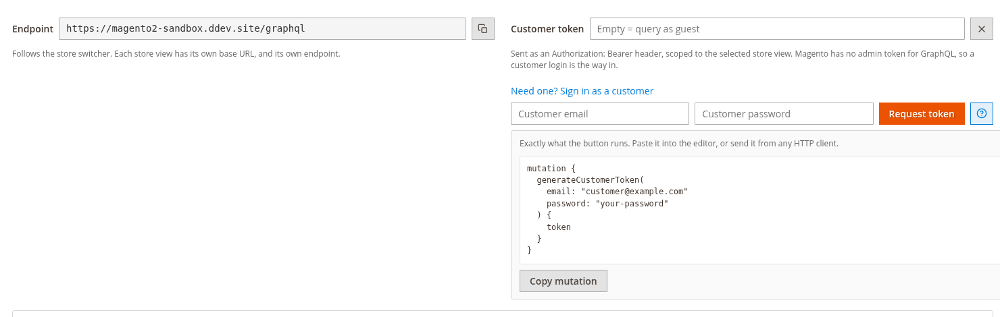
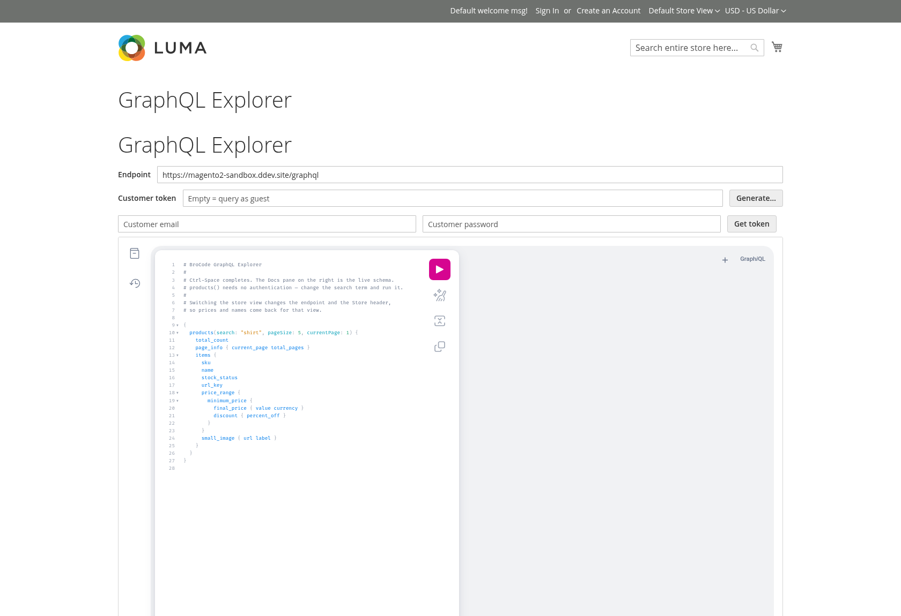

# BroCode GraphQL Explorer

An embedded [GraphiQL](https://github.com/graphql/graphiql) IDE inside the Magento 2
Adminhtml, with a store-view switcher wired to Magento's GraphQL `Store` header.

Magento ships a GraphQL endpoint and no way to explore it. You end up in Postman,
hand-writing headers, guessing at the schema, and forgetting that a query answers
differently per store view. This puts the schema, autocompletion and live docs
behind an ACL-protected admin page, and makes switching store views one dropdown.



*System → Tools → GraphQL Explorer. Magento's own store switcher drives the `Store` header; the endpoint below it follows the selection.*

## What it does

- **Full GraphiQL 3** — schema-aware autocompletion (Ctrl-Space), live docs pane,
  query history, prettify, variables editor.
- **Store-view switcher** — Adminhtml uses Magento's own switcher, the same block
  the dashboard uses. It sets the `Store` request header, which is how Magento
  selects a store view for GraphQL.
- **Per-store endpoint**, shown read-only with a copy button. Store views can sit
  on different base URLs, so the endpoint follows the switcher — querying view B
  through view A's host returns view A's data whatever the header says.
- **Customer token with inline generation** — paste one, or expand *Sign in as a
  customer* and have `generateCustomerToken` run for you. A `?` reveals the exact
  mutation, copyable, for running it elsewhere. One click clears the token and
  drops back to guest queries.
- **A default query worth running** — `products()`, which needs no authentication
  and is store-sensitive, so switching views visibly changes the result.
- **Native Magento styling** — `admin__control-text` and `action-*` in Adminhtml,
  `input-text` and `action` on the storefront, and errors rendered with Magento's
  own `message message-error` markup.
- **ACL-protected** — `BroCode_GraphQlExplorer::explorer`, under *System → Tools*.
- **Optional public route** for integrators at `/graphql-explorer`, off by
  default, with configurable Basic Auth. See below.
- **No CDN, no build step** — React and GraphiQL are vendored UMD builds served
  from the module's own `view/base/web`. Works offline and hands no third party a
  request from your Adminhtml.

## Install

```bash
composer require brocode/module-graphql-explorer
bin/magento module:enable BroCode_GraphQlExplorer
bin/magento setup:upgrade
bin/magento setup:static-content:deploy -a adminhtml   # production mode only
bin/magento cache:flush
```

Then **System → Tools → GraphQL Explorer**.

## Two things about Magento's GraphQL auth

Worth knowing before you file a bug against this module:

**There is no admin token for GraphQL.** Admin bearer tokens are a REST concept.
Magento provides no mutation that mints one for GraphQL, so this page queries as a
guest unless you supply a *customer* token — get one from `generateCustomerToken`:

```graphql
mutation {
  generateCustomerToken(email: "customer@example.com", password: "…") {
    token
  }
}
```

**The `Store` header is not honoured everywhere.** For most queries it selects the
store view correctly. On some customer-scoped operations Magento resolves the store
from the token instead and ignores the header
([magento/graphql-ce#770](https://github.com/magento/graphql-ce/issues/770)). If a
customer-scoped query ignores your switcher, that is upstream behaviour, not this
module.

## What you can and cannot write

Integrators reach for this and immediately ask whether they can manage products
through it. **No.** Magento's GraphQL is a storefront API. Introspecting the
`Mutation` type on a stock 2.4.8 install returns 67 mutations, and every one of
them is storefront-scoped:

| Area | Mutations |
|---|---|
| Cart and checkout | 33 |
| Customer and account | 26 |
| Compare lists | 5 |
| Wishlist | 4 |
| Product reviews | 1 |
| Misc (`contactUs`, `confirmEmail`, `sendEmailToFriend`, …) | 5 |

There is **no** mutation for creating or updating a product, category or
attribute, and none touching stock, prices, invoices, shipments or credit memos.
The only two whose names look like catalog writes — `createProductReview` and
`updateProductsInWishlist` — are a review and a wishlist operation.

Product management, order processing and inventory are REST and SOAP territory.
If you are integrating an ERP or a PIM, GraphQL is the wrong surface and REST is
the right one. Check it yourself in the explorer:

```graphql
{ __type(name: "Mutation") { fields { name description } } }
```

## Screenshots

**Customer tokens, generated inline**



The `?` beside *Request token* reveals the exact mutation, copyable, for running it from any HTTP client. One click on the ✕ clears the token and drops back to guest queries.

**The optional public route**



`/graphql-explorer`, for integrators who need the schema without an admin account. Disabled by default, Basic Auth on by default, store switching off by default.

## Requirements

Magento 2.4.x, PHP 8.1–8.4. No other dependencies.

## Configuration

None. The endpoint URL is derived from the default store's base URL rather than the
admin URL, because the admin may live on its own domain where `/graphql` does not
exist.

## CSP

`etc/csp_whitelist.xml` allows `'self'` for `style-src` and `connect-src`, and
`blob:` for `worker-src`, which is what the editor needs. No external host is
whitelisted — everything is served locally by design.

## Third-party assets

Vendored deliberately. See [`VENDOR-ASSETS.md`](VENDOR-ASSETS.md) for versions,
licences (all MIT) and how to refresh them.

## Public explorer for integrators

Off by default. When enabled it serves a `/graphql-explorer` route in the spirit
of Magento's own `/swagger`, so an integrator can read the schema without an
admin account.

Configure under **Stores → Configuration → Services → BroCode GraphQL Explorer**:

| Setting | Default | Notes |
|---|---|---|
| Enable Public Explorer | **No** | When off the route returns 404, not 403, so it does not advertise itself. |
| Require Basic Authentication | Yes | Only meaningful over HTTPS. Blank user or password denies everyone rather than allowing everyone. |
| Basic Auth User / Password | — | Password stored encrypted (`type="obscure"` + the Encrypted backend model). |
| Allow Store Switching | **No** | When on, the page lists every active store code to whoever can reach it. |

The page is marked `cacheable="false"` and sends `no-store`. That is load-bearing:
without it the full page cache stores the authorised response and then serves it
to anonymous visitors, which silently defeats Basic Auth. It was caught exactly
that way during testing.

Enabling this exposes no data that `/graphql` does not already expose —
introspection is on by default on a stock install — but it does make the schema
convenient to browse. Treat that as a decision, not a default.

## Licence

MIT — see [LICENSE](LICENSE).

Built by [Benjamin Rosenberger](https://brocode.at). If it saved you an afternoon,
[buy me a coffee](https://www.buymeacoffee.com/brosenberger).
